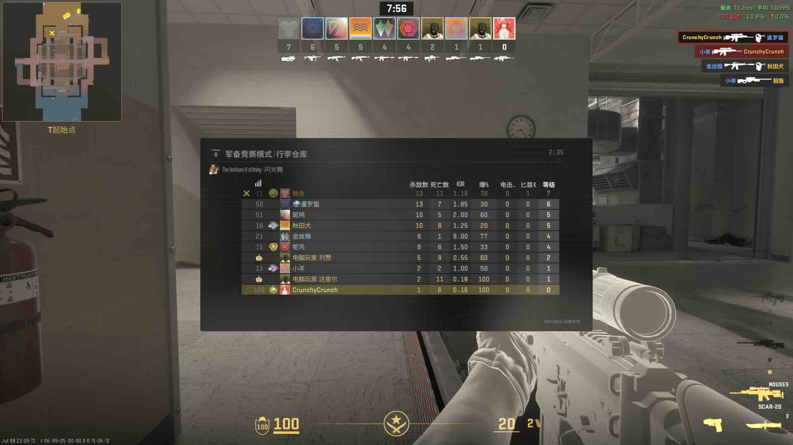

*延迟120ms。。。但是也不是不能打～*

前几天心血来潮，在台式机上重新安装了Linux，而这次选择的发行版是基于Arch的[CachyOS](https://cachyos.org)。想到有时候想跟国内朋友一起玩CS2，下定决心研究一下在Linux上运行UU加速器的方法。经过一天半的尝试，总结出了以下经验。

## 更改主机名

这个是最重要的一步！将你的Linux系统主机名改为`steamdeck`，可使用以下指令：

```sh
sudo hostnamectl set-hostname steamdeck
```

虽然这个步骤极其地不优雅，但是UU加速器貌似会检测主机名。如果稍后选择安装Linux版的UU加速器客户端，主机名不符合会导致App内报错，无法加速。如果在路由器安装了OpenWrt版的UU加速器，则不会识别到电脑，无法选择加速。

如果有更好的办法，还请读者测试反馈... 🙃

## 安装Linux版UU加速器

> ### 三天使用后追加...
> 写完文章之后又使用了几遍，发现uudeck-bwrap在系统重启后容易掉，需要频繁在App中重新绑定，目前已转原始的[uudeck](https://aur.archlinux.org/packages/uudeck)。虽然理论上文件系统隔离不如前者，但目前测试下来体验略好过前者。建议安装尝试找到适合自己系统的版本。如欲安装，则需将下述指令的`paru uudeck-bwrap`替换为`paru uudeck`。启动服务的指令保持不变。

如果是Arch系系统，推荐安装AUR的[uudeck-bwrap](https://aur.archlinux.org/packages/uudeck-bwrap)，版本最近刚刚更新。此处使用[paru](https://github.com/morganamilo/paru)：

```sh
paru uudeck-bwrap
```

随后可以启动服务：

```sh
sudo systemctl start uuplugin.service
```

也可以设置开机自启动：

```sh
sudo systemctl enable --now uuplugin.service
```

如配置了防火墙，需要开启16363端口（[参考](https://aur.archlinux.org/packages/uudeck)，见评论区）。随后在[UU主机加速App](https://uu.163.com/console/)中照常配置加速即可，UU加速器的Linux版貌似没有桌面GUI。

## 其他发行版怎么办？

未测试，但是貌似直接运行官方提供的安装脚本（[官方手册链接](https://baike.sowellwell.com/router/item/64b8d44c04cb117f2316b062.html)）是可行的，简单搜索后找到了[一篇教程](https://xingye.me/?p=821)，欢迎尝试报告。此方案也不是很优雅，官方脚本不是很注重文件系统规范，会在包括`/home/uu`和`/tmp`在内的各种目录创建文件。

### 替代方案：OpenWrt旁路由

我当时没有发现Linux的UU客户端会检查主机名，以为Linux客户端有什么其他问题，误打误撞配置了一个OpenWrt树莓派（五代）。专门做Linux电脑的旁路由，安装UU加速器插件，加速效果尚可。大致步骤如下：

1. 刷入[`openwrt-24.10.7-bcm27xx-bcm2712-rpi-5-squashfs-factory.img`](https://openwrt.github.io/firmware-selector-openwrt-org/?version=24.10.7&target=bcm27xx%2Fbcm2712&id=rpi-5)，官方脚本貌似还没有支持最新版OpenWrt的包管理
2. 扩展root分区（<https://openwrt.org/docs/guide-user/advanced/expand_root>）
3. 参考官方指南（<https://router.uu.163.com/app/html/online/baike_share.html?baike_id=5f963c9304c215e129ca40e8>），运行安装脚本，手动安装`kmod-tun`依赖
4. 手机App内照常配置

## 备注

没有测试用Wine/Bottles运行UU加速器的Windows版，感觉虚拟网卡不在Wine的功能范畴内，毕竟涉及到驱动/内核组件。
